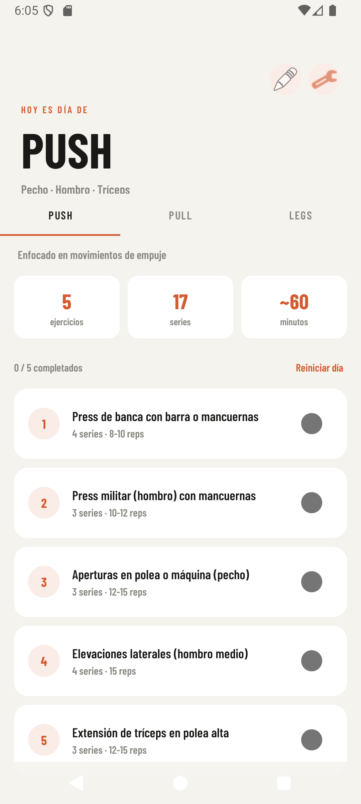
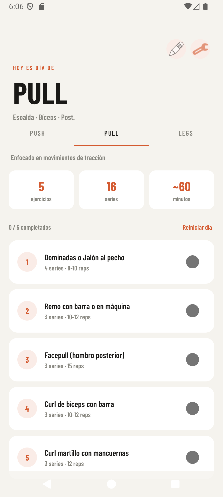
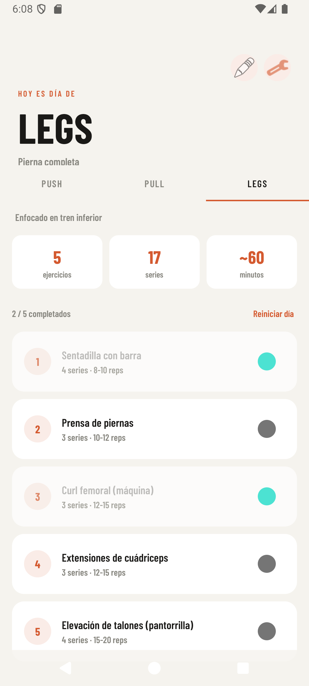
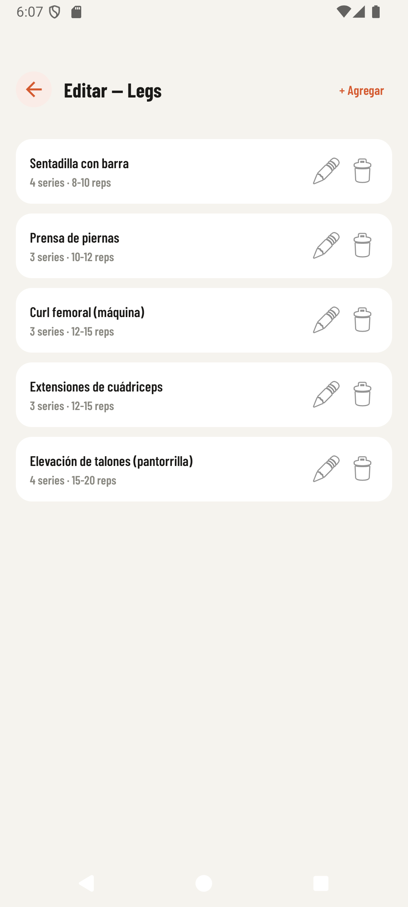
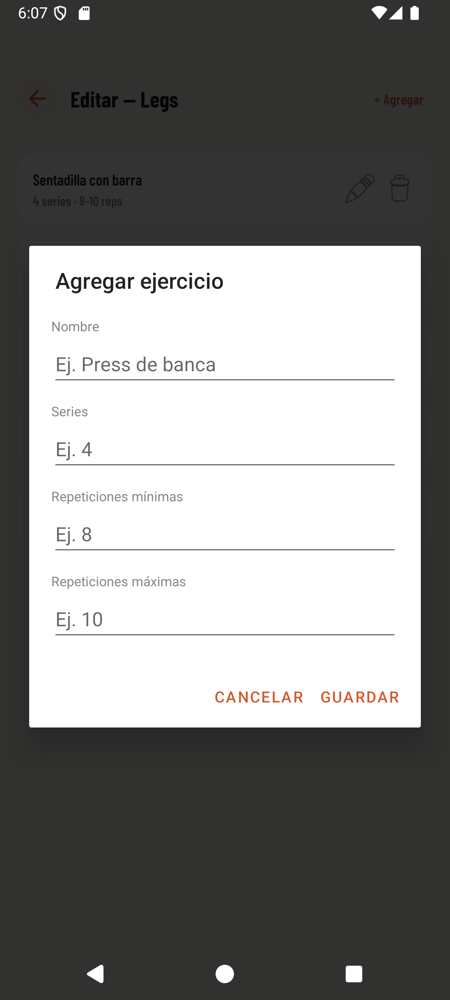
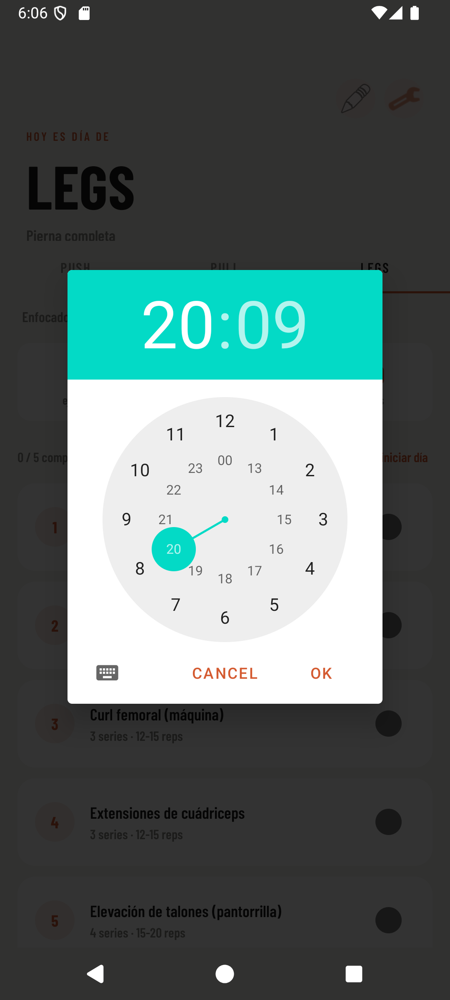
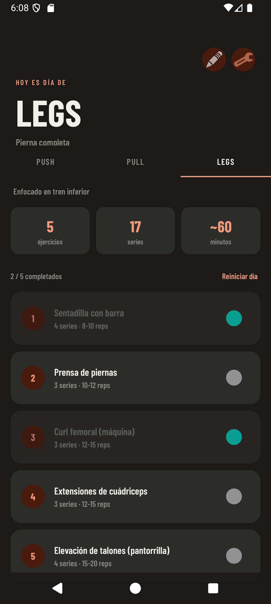

<div align="center">

<br/>

```
██████╗ ██╗   ██╗████████╗██╗███╗   ██╗
██╔══██╗██║   ██║╚══██╔══╝██║████╗  ██║
██████╔╝██║   ██║   ██║   ██║██╔██╗ ██║
██╔══██╗██║   ██║   ██║   ██║██║╚██╗██║
██║  ██║╚██████╔╝   ██║   ██║██║ ╚████║
╚═╝  ╚═╝ ╚═════╝    ╚═╝   ╚═╝╚═╝  ╚═══╝
```

**Tu rutina PPL. Simple, bonita, sin excusas.**

[](https://developer.android.com)
[](https://kotlinlang.org)
[](https://m3.material.io)
[](LICENSE)

<br/>

</div>

---

## ¿Qué es Rutin?

**Rutin** es una app Android para seguir tu rutina de gym estilo **Push / Pull / Legs**. Sin suscripciones, sin cuenta, sin ruido. Solo tú y tus ejercicios.

Diseñada con una estética editorial deportiva — tipografía condensada, fondo cálido, acento coral — para que abrir la app antes de entrenar se sienta bien.

---
## Capturas de pantalla

### Modo claro

<div align="center">
<table>
  <tr>
    <td align="center"><br/><sub>Push</sub></td>
    <td align="center"><br/><sub>Pull</sub></td>
    <td align="center"><br/><sub>Legs con progreso</sub></td>
  </tr>
  <tr>
    <td align="center"><br/><sub>Editar rutina</sub></td>
    <td align="center"><br/><sub>Agregar ejercicio</sub></td>
    <td align="center"><br/><sub>Recordatorio</sub></td>
  </tr>
</table>
</div>

### Modo oscuro

<div align="center">
<table>
  <tr>
    <td align="center"><br/><sub>Dark — Legs con progreso</sub></td>
  </tr>
</table>
</div>
---


## Funciones

| | |
|---|---|
| 💪 **Rutina PPL completa** | Push, Pull y Legs con ejercicios, series y repeticiones |
| ✅ **Progreso por día** | Marca ejercicios como completados, se guardan al cerrar |
| ✏️ **Edita tu rutina** | Agrega, edita o elimina ejercicios en cada día |
| 🔔 **Recordatorio diario** | Notificación a la hora que elijas, persiste al reiniciar |
| 🌙 **Modo oscuro** | Sigue automáticamente el tema del sistema |
| 💾 **Persistencia local** | Todo se guarda en SharedPreferences, sin internet |

---

## Stack

```
Kotlin
├── ViewPager2 + TabLayout       — navegación entre días
├── CollapsingToolbarLayout      — header animado
├── SharedPreferences + JSON     — persistencia de datos
├── AlarmManager                 — notificaciones programadas
└── Material Components 3        — tema claro / oscuro
```

---

## Estructura del proyecto

```
app/src/main/
├── java/com/example/rutin/
│   ├── MainActivity.kt              — Activity principal
│   ├── DayFragment.kt               — Fragmento por día de entrenamiento
│   ├── DayPagerAdapter.kt           — Adaptador del ViewPager
│   ├── WorkoutData.kt               — Datos y persistencia de ejercicios
│   ├── ProgressManager.kt           — Progreso de checkboxes por día
│   ├── EditExercisesActivity.kt     — Pantalla de edición de rutina
│   ├── NotificationReceiver.kt      — BroadcastReceiver de notificaciones
│   └── NotificationScheduler.kt     — Programación del AlarmManager
└── res/
    ├── layout/
    │   ├── activity_main.xml
    │   ├── activity_edit_exercises.xml
    │   ├── fragment_day.xml
    │   ├── item_exercise.xml
    │   ├── item_edit_exercise.xml
    │   └── dialog_exercise.xml
    ├── values/          — colores, estilos (tema claro)
    ├── values-night/    — colores (tema oscuro)
    ├── drawable/        — badges, checkboxes, íconos
    └── font/            — Barlow Condensed Bold + SemiBold
```

---

## Instalación

### Requisitos

- Android Studio Hedgehog o superior
- SDK mínimo: API 26 (Android 8.0)
- Kotlin 1.9+

### Pasos

```bash
# 1. Clona el repositorio
git clone https://github.com/tu-usuario/rutin.git

# 2. Abre el proyecto en Android Studio
# File → Open → selecciona la carpeta /rutin

# 3. Sincroniza dependencias
# Android Studio lo hará automáticamente (Sync Now)

# 4. Ejecuta en emulador o dispositivo físico
# Run → Run 'app'  o  Shift + F10
```

### Dependencias en `build.gradle`

```groovy
dependencies {
    implementation 'androidx.core:core-ktx:1.12.0'
    implementation 'androidx.appcompat:appcompat:1.6.1'
    implementation 'com.google.android.material:material:1.11.0'
    implementation 'androidx.viewpager2:viewpager2:1.0.0'
    implementation 'androidx.cardview:cardview:1.0.0'
    implementation 'androidx.coordinatorlayout:coordinatorlayout:1.2.0'
}
```

---

## La rutina incluida

### 💥 Día 1 — Push
> Pecho · Hombro · Tríceps

- Press de banca con barra o mancuernas — 4×8-10
- Press militar con mancuernas — 3×10-12
- Aperturas en polea o máquina — 3×12-15
- Elevaciones laterales — 4×15
- Extensión de tríceps en polea alta — 3×12-15

### 🔗 Día 2 — Pull
> Espalda · Bíceps · Hombro posterior

- Dominadas o Jalón al pecho — 4×8-10
- Remo con barra o en máquina — 3×10-12
- Facepull — 3×15
- Curl de bíceps con barra — 3×10-12
- Curl martillo con mancuernas — 3×12

### 🦵 Día 3 — Legs
> Pierna completa

- Sentadilla con barra — 4×8-10
- Prensa de piernas — 3×10-12
- Curl femoral — 3×12-15
- Extensiones de cuádriceps — 3×12-15
- Elevación de talones — 4×15-20

> Todos los ejercicios son editables desde la app.

---

## Diseño

La paleta está inspirada en publicaciones deportivas de los 70s. Cálida, contrastante, sin el azul corporativo de siempre.

| Token | Claro | Oscuro |
|---|---|---|
| Background | `#F5F3EE` | `#1A1917` |
| Surface | `#FFFFFF` | `#2C2C2A` |
| Accent | `#D45A30` | `#F0997B` |
| Text primary | `#1A1917` | `#F1EFE8` |
| Text secondary | `#888780` | `#888780` |

Fuente: **Barlow Condensed** (Bold + SemiBold) vía Google Fonts.

---

## Licencia

MIT — úsalo, modifícalo, mejóralo.

---

<div align="center">

Hecho con Kotlin y full agua del garrafón 💧🫙

</div>
